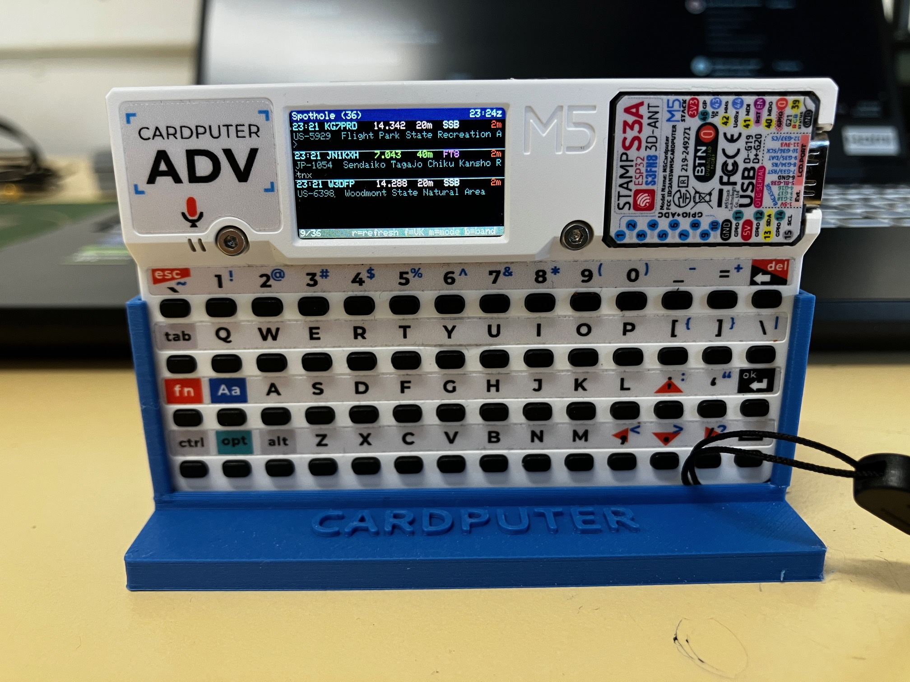
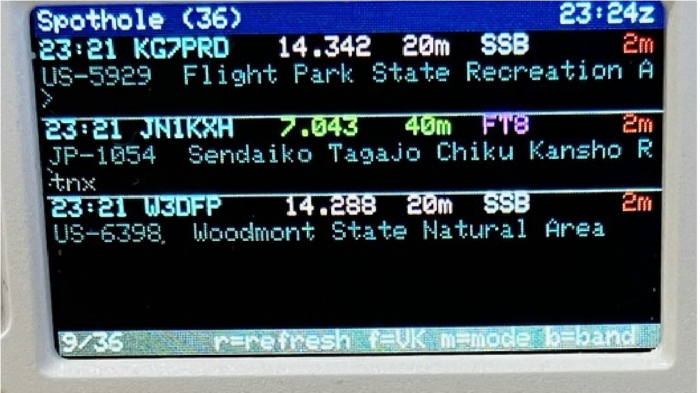

# Spothole Cardputer

A live outdoor-activation spot viewer for the **M5Stack Cardputer / Cardputer-Adv**. It pulls current spots from the [Spothole](https://spothole.app) API (POTA, SOTA, WWFF and others), sorts them, and shows them on the Cardputer's 240×135 screen with colour-coded bands, modes and spot age.

Built for portable operating: check what's on the air from your pocket, filter to VK/ZL, and jump straight to the frequency.





## Features

- Live spots from Spothole, refreshed automatically every 5 minutes (or on demand)
- Three lines per spot: time / callsign / frequency / band / mode / age, then reference and name, then the spotter's comment
- Colour coding by programme, band, mode and spot age
- **VK/ZL filter** based on callsign prefix
- **Mode filter** cycling through ALL / SSB / CW / FT8 / FM
- **Sort** by newest first or by band (ascending frequency)
- Footer shows the position of the top spot in the list (e.g. `3/34`)
- Spots older than 60 minutes are hidden (once the clock has synced)
- WiFi credentials entered on the device keyboard and stored in flash, so they survive power cycles
- Time is synced over NTP and displayed in UTC

## Hardware

- M5Stack Cardputer or Cardputer-Adv
- A 2.4 GHz WiFi network with internet access

## Software requirements

| Requirement | Notes |
|---|---|
| Arduino IDE | Board package: **M5Stack** |
| Board | `M5Cardputer` (Tools > Board) |
| [M5Cardputer](https://github.com/m5stack/M5Cardputer) | Library Manager, accept "Install All" for M5Unified / M5GFX |
| [ArduinoJson](https://arduinojson.org) | Library Manager, **v6.x** (the sketch uses the v6 `DynamicJsonDocument` API) |

`WiFi`, `WiFiClientSecure`, `HTTPClient`, `Preferences` and `time` ship with the ESP32 Arduino core.

## Installation

1. Install the libraries above.
2. Put `Spothole_Cardputer.ino` in a folder named `Spothole_Cardputer` (Arduino requires the folder name to match the sketch).
3. Select the **M5Cardputer** board and the correct serial port.
4. Upload.
5. On first boot, type your WiFi SSID and password when prompted. Press **Enter** to confirm each and **Del** to backspace.

## Controls

| Key | Action |
|---|---|
| `;` | Scroll up one spot |
| `.` | Scroll down one spot |
| `,` | Page up |
| `/` | Page down |
| `r` | Refresh now |
| `f` | Toggle VK/ZL-only filter |
| `m` | Cycle mode filter (ALL / SSB / CW / FT8 / FM) |
| `b` | Toggle sort: newest first / by band |
| `w` | Re-enter WiFi credentials |

## Display

```
12:34 VK3ABC   14.285  20m  SSB       3m
VKFF-0001  Some National Park
Comment from the spotter
```

**Line 1** is coloured in segments:

- **Time and callsign**: SOTA yellow, POTA cyan, WWFF green, anything else white
- **Frequency and band**: colour per band
- **Mode**: CW green, SSB/AM white, FT8/FT4 magenta, FM yellow, RTTY/PSK/DATA/JS8 orange
- **Age**: red under 5 min, orange 5-15 min, cyan beyond that (grey until NTP has synced)

**Line 2** is the park or summit reference and name. **Line 3** is the spot comment.

**Header** shows active filter/sort tags, the number of visible spots, and the UTC time. **Footer** shows the position counter and a status message.

### Band colours

| Band | Colour | Band | Colour |
|---|---|---|---|
| 160m | Red | 15m | Magenta |
| 80m | Orange | 12m | Light grey |
| 60m | Yellow | 10m | White |
| 40m | Green | 6m | Purple |
| 30m | Pink | 2m | Maroon |
| 20m | Blue | 70cm | Olive |
| 17m | Cyan | | |

## Configuration

Constants near the top of `Spothole_Cardputer.ino`:

| Constant | Default | Purpose |
|---|---|---|
| `SPOTHOLE_URL` | `https://spothole.app/api/v1/spots?limit=50` | API endpoint |
| `AUTO_REFRESH_MS` | 5 minutes | Auto-refresh interval |
| `MAX_SPOTS` | 50 | Maximum spots stored |
| `ROW_H` | 30 | Pixel height per spot (three 10 px lines) |
| `MODE_LIST` | ALL, SSB, CW, FT8, FM | Modes the `m` key cycles through |

The JSON buffer in `fetchSpothole()` is `DynamicJsonDocument doc(32768)`. If the footer shows `JSON:NoMemory`, increase it.

## Notes and limitations

- The mode filter matches the mode string exactly, so a spot reported as `USB` won't appear under `SSB`.
- The 60-minute age cutoff is applied when the list is rebuilt (on fetch or when changing filters), not continuously.
- The HTTPS connection uses `setInsecure()`, meaning the server certificate is not verified. That's fine for public spot data but worth knowing.
- WiFi credentials are stored unencrypted in the ESP32's NVS flash.
- The band lookup covers the common HF, 6 m, 2 m and 70 cm allocations. Anything else shows `?`.

## Credits

- Spot data from [Spothole](https://spothole.app), which aggregates POTA, SOTA, WWFF and other activation programmes
- Built on [M5Cardputer](https://github.com/m5stack/M5Cardputer), [M5Unified/M5GFX](https://github.com/m5stack) and [ArduinoJson](https://arduinojson.org)

## Licence

MIT
